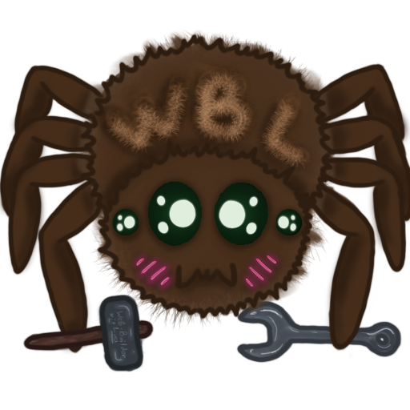

# WBL

> [!IMPORTANT]  
> Work on the project is suspended for an indefinite time. I bit off more than I could chew, so for now I'll continue working on smaller projects and eventually when I'll have more experience I will probably come back. But feel free to fork it and do some stuff of your own!

## What is it?
An application for visually constructing a web-site (.html's, .css's and other stuff).
Made in Lua using Love2d library.

The idea of how it supposed to works is quite simple:
To create your own website, you need to make a project
The project will have index.html styles.css and special project file - WBLI_*project name*.AT
It WBLI allows WBL to save state of the project and assebmle html/css...

Also I plan to add git-pages support with some basic git integration (automatic deployment of the site, saving-building with automatic commits)

The project is still in progress
