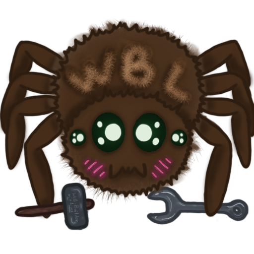

# WBL
## What is it?
An application for visually constructing a web-site (.html's, .css's and other stuff).
Made in Lua using Love2d library.

The idea of how it supposed to works is quite simple:
To create your own website, you need to make a project
The project will have index.html styles.css and special project file - WBLI_*project name*.AT
It WBLI allows WBL to save state of the project and assebmle html/css...

Also I plan to add git-pages support with some basic git integration (automatic deployment of the site, saving-building with automatic commits)

The project is still in progress
